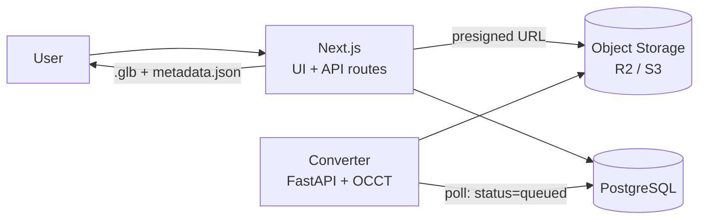

# Architecture

[Türkçe](ARCHITECTURE.md) · **English**

A web based CAD model management platform. The focus is on **detailed,
CAD-quality 3D inspection** of uploaded models in the browser; file sharing and
the catalogue exist to support that.

This document targets an MVP built by a single developer in roughly one month.

---

## 1. Core design decision

The hard part of this project is not upload, listing or comments — it is
**rendering a B-rep CAD file such as STEP meaningfully in a browser**. The
architecture is therefore built around a **conversion (tessellation) service**.

Two options were considered:

| Approach | Pros | Cons |
|---|---|---|
| **A. WASM on the client** (`occt-import-js`) | ~1 day to integrate, no separate service | Meshes, hierarchy and colours only. No exact measurement, mass properties or face-level selection. Large files consume browser memory. |
| **B. OCCT on the server** (Python + OCP) | Full access to B-rep topology: exact volume/area/centre of mass, edge curves, face- and edge-level selection and measurement. Process once, serve a light `.glb` to everyone. | A separate service. Steep learning curve. |

**Chosen: B.** The product's differentiator is "detailed inspection", so access
to topological data is non-negotiable. Without edge curves a model looks like a
pile of triangles, and exact mass properties cannot be derived from a mesh.

---

## 2. System overview



- **Uploads** go straight from the browser to object storage via a presigned
  URL. They are not proxied through Next.js — that hits the serverless body
  size limit.
- The **converter** is a separate service polling the database for
  `status = 'queued'`. There is no Redis/Celery in the MVP; database polling is
  sufficient and far easier to debug.
- The **viewer** only ever consumes the derived `.glb` and `metadata.json`; it
  never downloads the original CAD file.

---

## 3. Technology stack

### Frontend / application
- **Next.js 15 (App Router) + TypeScript** — UI and CRUD APIs in one repo
- **React Three Fiber + drei** (three.js) — the viewer
- **three-mesh-bvh** — fast raycasting; selection and measurement stutter on
  large models without it
- **Tailwind + shadcn/ui** — to avoid spending time on UI primitives
- **zustand** — viewer state (selected part, active tool, clipping plane,
  explode factor)

### Converter service
- **Python + FastAPI**. Local development runs in a virtualenv; the Docker
  image is for deployment (see the note below)
- **OCCT bindings**: `cadquery-ocp` (pip) — alternatively `pythonocc-core` (conda)

  > **Verified 2026-08-24.** `cadquery-ocp` 7.9.3.1.1 installed cleanly with
  > pip on macOS arm64 / Python 3.12; a STEP write/read round trip, exact mass
  > properties, tessellation and edge extraction all produced correct results.
  > Docker is not required for local development. Fly.io and Railway build the
  > image remotely, so local Docker may not be needed for deployment either.
- **trimesh** — the light path for mesh formats (STL/OBJ/PLY)
- Output: a **Draco/meshopt compressed `.glb`** plus `metadata.json`

### Data and infrastructure
- **PostgreSQL** (Neon or Supabase) + **Drizzle ORM**
- **Cloudflare R2** (or S3) — original CAD, derived glb, thumbnails
- **Auth.js v5** — (Clerk if zero effort is preferred)

### Deployment
- Next.js → **Vercel**
- Converter → **Fly.io / Railway** (Docker)
- Storage → **R2**

---

## 4. Data model (draft)

```sql
users(id, email, name, image, created_at)

projects(id, owner_id → users, name, slug, description,
         visibility ENUM('private','public'), created_at)

models(id, project_id → projects, name, description,
       current_version_id → model_versions, created_at)

model_versions(
  id, model_id → models, version_no,
  source_key,          -- R2: original CAD file
  source_format,       -- step | iges | stl | obj | glb
  source_size_bytes,
  glb_key,             -- R2: derived viewer file
  metadata_key,        -- R2: metadata.json
  thumbnail_key,
  status,              -- queued | processing | ready | failed
  error_message,
  stats_json,          -- volume, area, bbox, centre of mass, part/triangle counts
  created_by → users, created_at
)

annotations(id, model_version_id → model_versions, author_id → users,
            body, anchor_json,   -- 3D point + normal + part id
            resolved_at, created_at)

comments(id, model_id → models, author_id → users, body, created_at)

project_members(project_id, user_id, role ENUM('owner','editor','viewer'))
```

Versioning lives on `model_versions`, not `models`. Every version keeps its own
`.glb` permanently so past revisions can be opened side by side in the viewer.

---

## 5. Conversion pipeline

When a `model_versions` row with `status = 'queued'` is picked up:

1. Download the original from R2, set `status = 'processing'`.
2. Read according to format:
   - **STEP / IGES** → OCCT `STEPControl_Reader` / `IGESControl_Reader`
   - **STL / OBJ / PLY** → trimesh
3. Walk the **assembly tree** (`XCAFDoc_ShapeTool`): part names, hierarchy,
   colours, transform matrices.
4. For each solid:
   - **Tessellate** with `BRepMesh_IncrementalMesh` (adjustable deflection)
   - **Exact volume, surface area and centre of mass** via `BRepGProp`
   - Bounding box via `Bnd_Box`
   - Extract **edges** as polylines sampled from the curve; they ride in the
     same `.glb` as LINES primitives → `LineSegments` in the viewer
   - Tag triangles by their **face groups** → enables face-level selection
5. Write the result as a single `.glb` (Draco/meshopt) together with
   `metadata.json` and upload both to R2. A small thumbnail render is produced
   here as well.
6. Set `status = 'ready'` and fill `stats_json`. On failure set
   `status = 'failed'` with an `error_message`.

**Deflection tuning is critical.** With a fixed, fine value a 50 MB STEP file
produces a 300 MB glb. Deflection should scale with the model's bounding box,
under a capped triangle budget.

The rough shape of `metadata.json`:

```json
{
  "tree": [{ "id": "n12", "name": "Bracket", "children": [], "meshIndex": 3 }],
  "parts": {
    "n12": { "volume_mm3": 12043.2, "area_mm2": 8891.0,
             "com": [12.0, 3.4, -8.1], "bbox": [[0,0,0],[40,20,10]] }
  },
  "units": "mm",
  "faceGroups": { "3": [[0, 240], [240, 512]] }
}
```

---

## 6. Viewer architecture

A single `<Viewer>` R3F scene surrounded by panels:

- **Scene**: the glb is loaded and a BVH is built per mesh via
  `three-mesh-bvh`. Edge polylines are drawn as a separate `LineSegments`
  layer — this is what produces the CAD look.
- **Assembly tree panel**: driven by `metadata.json → tree`. Show/hide, isolate,
  make transparent.
- **Selection**: raycast → mesh + triangle index → face id via `faceGroups`.
  Selection state lives in zustand; the tree and the scene share it.
- **Measurement tools**: point-to-point, edge length, radius/diameter, angle
  between two faces. Snapping priority: vertex > edge > face.
- **Clipping plane**: three.js `clippingPlanes`, one plane per axis plus a free
  plane.
- **Exploded view**: parts pushed outward from the centre of mass, driven by a
  single ratio slider.
- **Properties panel**: volume / area / bbox / centre of mass for the selected
  part.
- **Camera**: orbit + view cube + standard views (iso, front, top, right), plus
  "zoom to selection".
- **Markup**: notes pinned to 3D points (`annotations.anchor_json`).

One rule for state management: **the scene graph is not the source of truth.**
Visibility, selection and colour live in the zustand store and R3F components
read from it. Otherwise tree/scene synchronisation breaks down quickly.

---

## 7. Storage layout

```
r2://cad-models/
  {projectId}/{modelId}/{versionId}/
    source.step          # original, immutable
    model.glb            # derived, for the viewer
    metadata.json
    thumb.png
```

The original file is never served to the viewer; it is handed to authorised
users only, through a presigned download link.

---

## 8. API draft

| Method | Path | Description |
|---|---|---|
| `POST` | `/api/uploads/presign` | Issues a presigned PUT URL for upload |
| `POST` | `/api/models` | Creates the model and first version, `status=queued` |
| `POST` | `/api/models/:id/versions` | New revision |
| `GET` | `/api/models/:id` | Metadata and version list |
| `GET` | `/api/versions/:id/assets` | Presigned GET URLs for glb / metadata / thumb |
| `GET` | `/api/models?q=&format=&project=` | Search and filtering |
| `POST` | `/api/versions/:id/annotations` | 3D markup |

The converter service is not exposed publicly; it talks only to the database
and R2.

---

## 9. Out of scope (MVP)

- **Native CAD formats** (SLDPRT, CATPart, .prt, .ipt). No open source solution
  exists; a commercial SDK such as CAD Exchanger, HOOPS or Datakit is required.
  MVP formats: **STEP, STL, glTF/GLB**, and IGES if time allows.
- Real-time multi-user sessions (co-navigation).
- Reading PMI / GD&T annotations.
- Server-side high quality (raytraced) rendering output.

## 10. Risks

| Risk | Mitigation |
|---|---|
| ~~OCCT setup~~ | **Retired 2026-08-24.** Installation verified locally; see the note in section 3. |
| OCCT API learning curve | The remaining risk. One end-to-end STEP conversion must be done in week 1. |
| The Dockerfile has never been built | Local development works without it, so the image is unverified. Left until deployment week it will surprise you; build it once during week 3. |
| Very large STEP files | Scale deflection with the bounding box, cap the triangle budget, enforce a file size limit. |
| Measurement accuracy | Snap measurements to the topological data in `metadata.json`, not to the mesh. |
| Scope creep | Catalogue/social features (likes, follows, feeds) are out of scope; the value is in the viewer. |

---

## 11. Roadmap (4 weeks)

| Week | Goal |
|---|---|
| 1 | Skeleton: auth, database schema, presigned upload, converter service (STEP → glb + metadata), job status |
| 2 | Viewer core: R3F, glb loading, orbit + view cube, assembly tree, show/hide/isolate, edges, BVH picking |
| 3 | Inspection tools: measurement, clipping plane, exploded view, properties panel, screenshot, 3D markup |
| 4 | Product surface: model list/detail, search and filtering, versioning, sharing/permissions, deployment + buffer |

Leaving measurement and clipping to week 3 is deliberate: most of the demo value
sits there, but writing them before the viewer core has settled means writing
them twice.
