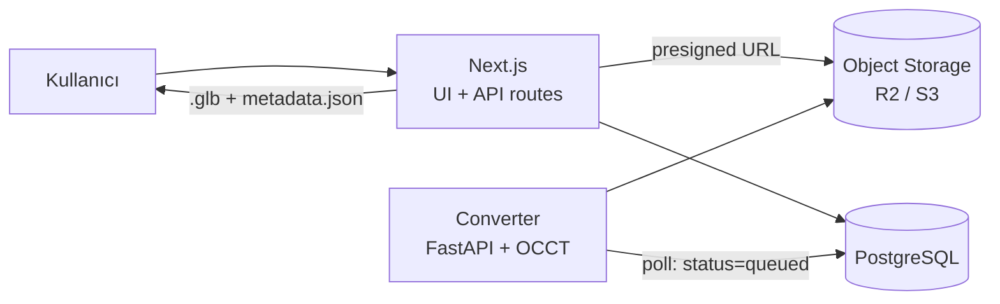

# Mimari

**Türkçe** · [English](ARCHITECTURE.en.md)

Web tabanlı CAD model yönetim platformu. Odak noktası, yüklenen CAD
dosyalarının tarayıcı üzerinde **detaylı ve gerçek CAD kalitesinde 3B
incelenmesi**; dosya paylaşımı ve katalog kısmı bunu destekleyen çerçeve.

Bu doküman tek geliştiricili, ~1 aylık bir MVP hedefine göre yazılmıştır.

---

## 1. Temel tasarım kararı

Projenin zor kısmı upload/liste/yorum değil, **STEP gibi B-rep tabanlı bir CAD
dosyasını tarayıcıda anlamlı biçimde gösterebilmek**. Bu yüzden mimarinin
merkezinde bir **dönüştürme (tessellation) servisi** var.

İki yol vardı:

| Yaklaşım | Artı | Eksi |
|---|---|---|
| **A. İstemcide WASM** (`occt-import-js`) | Kurulumu ~1 gün, ayrı servis yok | Sadece mesh + hiyerarşi + renk. Exact ölçüm, kütle özellikleri, yüzey bazlı seçim yok. Büyük dosya tarayıcı belleğini yer. |
| **B. Sunucuda OCCT** (Python + OCP) | B-rep topolojisine tam erişim: exact hacim/alan/ağırlık merkezi, kenar çizgileri, yüzey/kenar bazlı seçim ve ölçüm. Bir kez işle, herkese hafif `.glb` servis et. | Ayrı bir servis. Öğrenme eğrisi dik. |

**Seçim: B.** Ürünün ayırt edici değeri "detaylı inceleme" olduğu için,
topolojik veriye erişim vazgeçilmez. Kenar çizgileri (edge polyline) olmadan
model bir üçgen yığınına benzer; exact kütle özellikleri mesh'ten tahmin
edilemez.

---

## 2. Sistem görünümü



- **Yükleme** tarayıcıdan doğrudan object storage'a gider (presigned URL).
  Next.js üstünden geçirilmez — serverless body limitine takılır.
- **Converter** ayrı bir servistir; DB'yi `status = 'queued'` için yoklar.
  MVP'de Redis/Celery yok; DB polling yeterli ve ayıklanması çok daha kolay.
- **Viewer** yalnızca türetilmiş `.glb` ve `metadata.json` tüketir; orijinal
  CAD dosyasını asla indirmez.

---

## 3. Teknoloji stack

### Frontend / uygulama
- **Next.js 15 (App Router) + TypeScript** — UI ve CRUD API'leri tek repoda
- **React Three Fiber + drei** (three.js) — viewer
- **three-mesh-bvh** — hızlı raycast; seçim ve ölçüm bunsuz büyük modellerde takılır
- **Tailwind + shadcn/ui** — UI'a vakit harcamamak için
- **zustand** — viewer state (seçili parça, aktif araç, kesit düzlemi, patlatma oranı)

### Converter servisi
- **Python + FastAPI**. Yerel geliştirme sanal ortamda yürür; Docker imajı
  deploy içindir (aşağıdaki nota bakınız)
- **OCCT bindings**: `cadquery-ocp` (pip) — alternatif `pythonocc-core` (conda)

  > **Doğrulandı (2026-08-24).** `cadquery-ocp` 7.9.3.1.1, macOS arm64 /
  > Python 3.12 ortamına pip ile sorunsuz kuruldu; STEP yaz/oku turu, exact
  > kütle özellikleri, tessellation ve kenar çıkarma doğru sonuç verdi.
  > Docker yerel geliştirme için gerekli değil. Fly.io ve Railway imajı kendi
  > tarafında build ettiğinden deploy'da da yerel Docker'a ihtiyaç olmayabilir.
- **trimesh** — mesh formatları (STL/OBJ/PLY) için hafif yol
- Çıktı: **Draco/meshopt sıkıştırmalı `.glb`** + `metadata.json`

### Veri ve altyapı
- **PostgreSQL** (Neon veya Supabase) + **Drizzle ORM**
- **Cloudflare R2** (veya S3) — orijinal CAD, türetilmiş glb, thumbnail
- **Auth.js v5** — (sıfır efor isteniyorsa Clerk)

### Deploy
- Next.js → **Vercel**
- Converter → **Fly.io / Railway** (Docker)
- Storage → **R2**

---

## 4. Veri modeli (taslak)

```sql
users(id, email, name, image, created_at)

projects(id, owner_id → users, name, slug, description,
         visibility ENUM('private','public'), created_at)

models(id, project_id → projects, name, description,
       current_version_id → model_versions, created_at)

model_versions(
  id, model_id → models, version_no,
  source_key,          -- R2: orijinal CAD dosyası
  source_format,       -- step | iges | stl | obj | glb
  source_size_bytes,
  glb_key,             -- R2: türetilmiş viewer dosyası
  metadata_key,        -- R2: metadata.json
  thumbnail_key,
  status,              -- queued | processing | ready | failed
  error_message,
  stats_json,          -- hacim, alan, bbox, ağırlık merkezi, parça/üçgen sayısı
  created_by → users, created_at
)

annotations(id, model_version_id → model_versions, author_id → users,
            body, anchor_json,   -- 3B nokta + normal + parça id
            resolved_at, created_at)

comments(id, model_id → models, author_id → users, body, created_at)

project_members(project_id, user_id, role ENUM('owner','editor','viewer'))
```

Versiyonlama `models` değil `model_versions` üzerinden yürür; bir modelin
geçmiş revizyonları viewer'da yan yana açılabilsin diye her versiyonun kendi
`.glb`'si kalıcıdır.

---

## 5. Dönüştürme pipeline

`status = 'queued'` bir `model_versions` kaydı görüldüğünde:

1. Orijinal dosyayı R2'den indir, `status = 'processing'` yap.
2. Formata göre oku:
   - **STEP / IGES** → OCCT `STEPControl_Reader` / `IGESControl_Reader`
   - **STL / OBJ / PLY** → trimesh
3. **Assembly ağacını** gez (`XCAFDoc_ShapeTool`): parça isimleri, hiyerarşi,
   renkler, transform matrisleri.
4. Her katı için:
   - `BRepMesh_IncrementalMesh` ile **tessellate** (deflection ayarlanabilir)
   - `BRepGProp` ile **exact hacim, yüzey alanı, ağırlık merkezi**
   - `Bnd_Box` ile bounding box
   - **Kenarları** eğriden örnekleyerek polyline olarak çıkar; aynı `.glb`
     içinde LINES primitive'i olarak taşınır → viewer'da `LineSegments`
   - Üçgenleri **yüzey (face) gruplarına** göre etiketle → yüzey bazlı seçim
5. Sonucu tek `.glb` olarak yaz (Draco/meshopt), `metadata.json` ile birlikte
   R2'ye yükle. Küçük bir thumbnail render'ı da burada üretilir.
6. `status = 'ready'`, `stats_json` doldurulur. Hata olursa
   `status = 'failed'` + `error_message`.

**Deflection ayarı kritik.** Sabit ve ince bir değer kullanılırsa 50 MB'lık bir
STEP'ten 300 MB'lık glb çıkar. Model bounding box'ına göre orantılı bir
deflection ve üst sınırlı bir üçgen bütçesi uygulanmalı.

`metadata.json` şeması kabaca:

```json
{
  "tree": [{ "id": "n12", "name": "Bracket", "children": [], "meshIndex": 3 }],
  "parts": {
    "n12": { "volume_mm3": 12043.2, "area_mm2": 8891.0,
             "com": [12.0, 3.4, -8.1], "bbox": [[0,0,0],[40,20,10]] }
  },
  "units": "mm",
  "faceGroups": { "3": [[0, 240], [240, 512]] }
}
```

---

## 6. Viewer mimarisi

Tek bir `<Viewer>` R3F sahnesi, etrafında panel'ler:

- **Sahne**: glb yüklenir, `three-mesh-bvh` ile her mesh'e BVH kurulur.
  Kenar polyline'ları ayrı bir `LineSegments` katmanı olarak çizilir — CAD
  görünümünü veren şey budur.
- **Assembly ağacı paneli**: `metadata.json → tree`. Göster/gizle, izole et,
  şeffaflaştır.
- **Seçim**: raycast → mesh + üçgen indeksi → `faceGroups` ile yüzey id'si.
  Seçim durumu zustand'da; ağaç ve sahne aynı state'i paylaşır.
- **Ölçüm araçları**: nokta-nokta, kenar uzunluğu, yarıçap/çap, iki yüzey arası
  açı. Snap davranışı köşe > kenar > yüzey önceliğiyle.
- **Kesit düzlemi**: three.js `clippingPlanes`, eksen başına bir düzlem +
  serbest düzlem.
- **Patlatılmış görünüm**: parçaların ağırlık merkezinden dışa doğru,
  tek bir oran slider'ı ile.
- **Özellik paneli**: seçili parçanın hacim / alan / bbox / ağırlık merkezi.
- **Kamera**: orbit + view cube + standart görünümler (iso, ön, üst, sağ),
  "seçime odaklan".
- **Markup**: 3B noktaya iğnelenmiş notlar (`annotations.anchor_json`).

Koordinat sistemi: sahne **Z-up**'tır, yani CAD verisiyle aynı. Kameraya
`up = [0, 0, 1]` verilir; geometri three.js'in Y-up kabulüne döndürülmez.
Döndürülseydi özellik panelindeki her bounding box ve ağırlık merkezi,
ekrandaki nesneden farklı bir çerçevede kalırdı.

State yönetiminde kural: **sahne grafiği tek doğru kaynak değildir.** Görünürlük,
seçim ve renk zustand store'unda tutulur; R3F bileşenleri bunu okur. Aksi halde
ağaç paneli ile sahne senkronizasyonu kısa sürede bozulur.

---

## 7. Depolama düzeni

```
r2://cad-models/
  {projectId}/{modelId}/{versionId}/
    source.step          # orijinal, değişmez
    model.glb            # viewer için türetilmiş
    metadata.json
    thumb.png
```

Orijinal dosya viewer'a hiçbir zaman servis edilmez; yalnızca yetkili
kullanıcıya presigned indirme linki ile verilir.

---

## 8. API taslağı

| Yöntem | Yol | Açıklama |
|---|---|---|
| `POST` | `/api/uploads/presign` | Yükleme için presigned PUT URL üretir |
| `POST` | `/api/models` | Model + ilk versiyon kaydı, `status=queued` |
| `POST` | `/api/models/:id/versions` | Yeni revizyon |
| `GET` | `/api/models/:id` | Meta veri + versiyon listesi |
| `GET` | `/api/versions/:id/assets` | glb / metadata / thumb için presigned GET |
| `GET` | `/api/models?q=&format=&project=` | Arama ve filtre |
| `POST` | `/api/versions/:id/annotations` | 3B markup |

Converter servisi dışa açık değildir; yalnızca DB ve R2 ile konuşur.

---

## 9. Kapsam dışı (MVP)

- **Native CAD formatları** (SLDPRT, CATPart, .prt, .ipt). Açık kaynak
  çözümü yoktur; CAD Exchanger / HOOPS / Datakit gibi ticari SDK gerekir.
  MVP formatları: **STEP, STL, glTF/GLB**, vakit kalırsa IGES.
- Gerçek zamanlı çok kullanıcılı oturum (birlikte gezinme).
- PMI / GD&T anotasyonlarının okunması.
- Sunucu tarafı yüksek kaliteli render (raytrace) çıktısı.

## 10. Riskler

| Risk | Karşılık |
|---|---|
| ~~OCCT kurulumu~~ | **Elendi (2026-08-24).** Kurulum yerel ortamda doğrulandı; bölüm 3'teki nota bakınız. |
| OCCT API öğrenme eğrisi | Kalan risk. 1. haftada uçtan uca tek bir STEP dönüşümü bitmeli. |
| Dockerfile hiç build edilmedi | Yerel geliştirme onsuz yürüdüğü için imaj doğrulanmamış durumda. Deploy haftasına bırakılırsa orada sürpriz çıkar; 3. hafta içinde bir kez build edilmeli. |
| Devasa STEP dosyaları | Deflection'ı bbox'a göre ölçekle, üçgen bütçesi koy, dosya boyutu üst sınırı uygula. |
| Ölçüm doğruluğu | Ölçümü mesh üstünde değil, `metadata.json`'daki topolojik veriye snap'leyerek yap. |
| Kapsam kayması | Katalog/sosyal özellikler (beğeni, takip, akış) MVP dışı; değer viewer'da. |

---

## 11. Yol haritası (4 hafta)

| Hafta | Hedef |
|---|---|
| 1 | İskelet: auth, DB şeması, presigned upload, converter servisi (STEP → glb + metadata), job durumu |
| 2 | Viewer çekirdeği: R3F, glb yükleme, orbit + view cube, assembly ağacı, göster/gizle/izole, kenarlar, BVH picking |
| 3 | İnceleme araçları: ölçüm, kesit düzlemi, patlatılmış görünüm, özellik paneli, ekran görüntüsü, 3B markup |
| 4 | Ürün yüzeyi: model listesi/detay, arama-filtre, versiyonlama, paylaşım/izin, deploy + tampon |

Ölçüm ve kesit araçlarının 3. haftaya bırakılması bilinçlidir: demo değerinin
çoğu oradadır, ancak viewer çekirdeği oturmadan yazılırsa iki kez yazılır.
